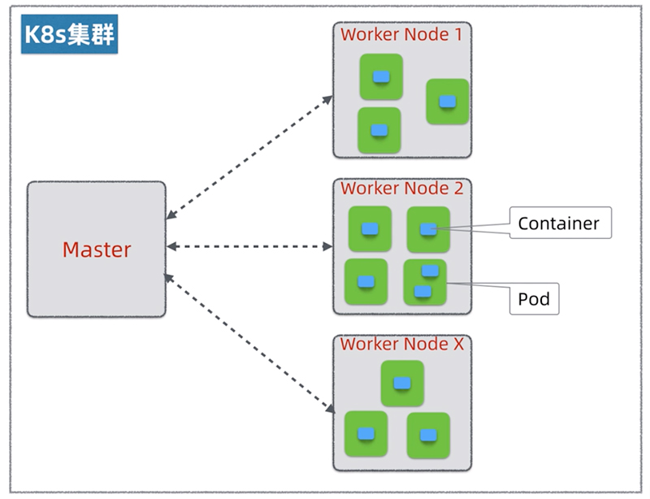
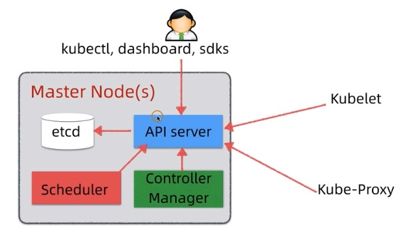

# hi-k8s

> learning k8s

## 基础

### `k8s`架构

`k8s`这个平台到底想帮我们解决什么问题？

- `k8s`主要是解决平台资料调度的问题。
  - 当有应用发布请求过来的时候，`k8s`需要根据集群资源的空闲状况，将应用的`Pods`合理的分配到空闲的`Worker Node`上
  - 同时`k8s`需要时刻监控集群，如果有节点或`Pod`挂了，它需要重新协调集群资源并启动`Pod`，保证应用的高可用，这个过程叫`Self-Healing`
  - 另外`k8s`还需要管理集群之间的网络，保障`Pod`之间可以互通互联

### Master节点

- `Master`是`k8s`集群的一个大脑，其有如下几部分构成：
  - `etcd`集中状态存储，所有集群状态数据，包括节点、pod、发布、配置都存储在这里，其核心是一个分布式`KV数据库`，实现了Raft分布一致性算法。
    - 正常为了保障`etcd`高可用，一般需要至少部署三个节点
    - `etcd`可以独立部署也可以和`Master`节点住在一起
  - `API server`是`k8s`集群接口和通讯总线
    - 用户可以通过`kubectl`、`dashboard`、`sdks`来操作`k8s`

### Pod

- 理解`k8s`的`Pod` —— **`虚拟机的抽象`**

### ReplicaSet

- `k8s`的`ReplicaSet`原理是什么？
- 玩一波`k8s`的自愈能力`self-healing`
